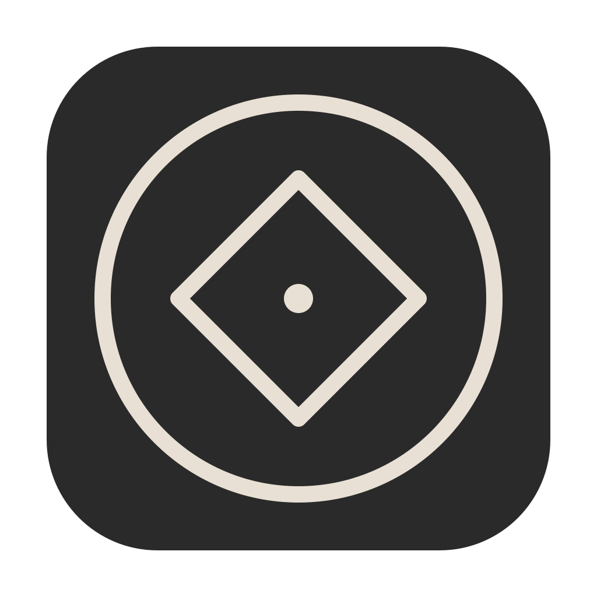

<p align="center">
  
</p>

<h1 align="center">Sigil</h1>

<p align="center"><em>Model an imagined application precisely enough that an agent can inhabit it.</em></p>

Sigil is a desktop editor for building that model. What it builds is a **domain model** in Eric Evans's sense: the application expressed in a *ubiquitous language*, where inside each named context a word is overridden to mean one exact thing. A *sigil* is such a context — a bounded, named region of language with its own affordances (what can be done in it) and invariants (what must hold). The word comes from the model's own vocabulary: *sigil* is both the editor and the concept.

## The idea

An application begins as a shape in your head: what it contains, and what it must do for you. You inhabit it in imagination — imagine using it — and name an object and its affordances: the few things it must let you do. You describe how each affordance works, in words. The words that carry weight are themselves objects you owe a definition, so you open a context for each, override it to mean one exact thing, and describe again from there. Each such word becomes a **sigil**: a bounded context with its own *affordances* — what can be done in it — and *invariants* — what must hold. Sigils nest, each level small enough to hold in attention at once. You stop when naming a leaf is enough: a door handle affords opening the door, and you do not care how it is made.

## A model you can inhabit, not just compile

A finished model is not only a blueprint a coding agent projects into code. It is a world an agent can *inhabit*. Give the agent one tool per affordance — a service that performs it — and it wears the sigil: it understands the domain language, and by inhabiting the context it knows which contrasts are constrained and how, and what it is allowed to do. Building the application then collapses to building the tools; the agent connects them into the sigil, and the running application is the attention living in that world.

To inhabit a sigil is to be embodied by it. Inside, an attention has state — a position in contrast space, a place in an ongoing narrative — and the boundary constrains what is relevant. That is the body it is given. The interaction surface is its cockpit, and a cockpit has to put the right affordance under the hand at the right moment — which is what a pattern language does, each affordance answering a recurring need in its context (Christopher Alexander). A well-made sigil focuses the attention that powers it.

## Structure over narrative

A description is *time-like*: turn-by-turn, compressed along a single relevance — did you reach the goal or not. That contrast is arbitrary, and everything off the path is thrown away. A structure is *space-like*: a map. A tree of sigils is how a stack of narratives — spells, in this vocabulary — translates into shape. Once you have the shape you can throw the spells away and orient by sight: look here, look there, take this route or that, instead of taxing attention with steps. A domain expert is someone who sees the shape and can choose any route across it; someone who has memorized one procedure can only walk the path, and is lost when the terrain shifts.

## Attention Language

The model of attention underneath all of this is itself modeled as sigils, in the same language as everything else. Attention is the given, and it is finite. An *observer* is attention paid from a point of view, taking in a *frame* all at once (space-like); an *agent* is an observer wearing a sigil, following a *narrative* one step at a time (time-like). Every distinction attention can make — inside or outside, allowed or forbidden, mine or not — is a *contrast*; a thing is a region in the space those contrasts span, and a sigil names it and writes its boundary down. A sigil protects attention: only its language is in scope while you work there, and everything outside is reachable by name — the way an identifier resolves outward through enclosing scopes in a program. The tree can grow past what anyone can hold. No single room in it may.

## This repo — the editor

You write plain markdown with the vision one keystroke away. The ontology tree records each sigil as it appears. A compiler counts every reference that fails to resolve — vague language is a build error. An AI design partner works in the same workspace with the same tools you hold: it reads the whole tree while you work in one context, compares structure against vision, and reports drift and broken boundaries. Its character is part of the model too, written as a sigil.

This editor is an early experiment, not a finished tool — the design partner's memory and parts of the runtime are still toys. It exists to show the loop can close: it was projected by a coding agent from a model written in the editor, with the partner that model describes. It is a work in progress, paused rather than abandoned — active work has moved to SigilAtlas for now, but the plan is to return, not least for the design partner itself: Bicameron ("B"), a bicameral-mind architecture whose memory is still being worked out.

A sigil lives on disk as plain directories and markdown — no proprietary format, no database, no lock-in. Put it in git and it versions like code.

```bash
npm install
npm run tauri dev
```

Tauri 2 desktop app: Rust backend, React + TypeScript + CodeMirror 6 frontend. macOS first. Requires Rust and Node.js — see the [Tauri prerequisites](https://v2.tauri.app/start/prerequisites/).

## See also

- **[Sigil Engineering](https://sigilengineering.com)** — the method behind all of this, in full, with a read-only web viewer of the live model (the ontology library described above, browsable at [`/#/viewer`](https://sigilengineering.com/#/viewer)).
- **[SigilAtlas](https://sigilatlas.com)** — the living instance: a shell inhabited by an agent, entangling with its maker over a photographic corpus. Its [Genesis](https://sigilatlas.com/conversations/) chronicles the build as dated dialogues between maker and machine.

## License

MIT
